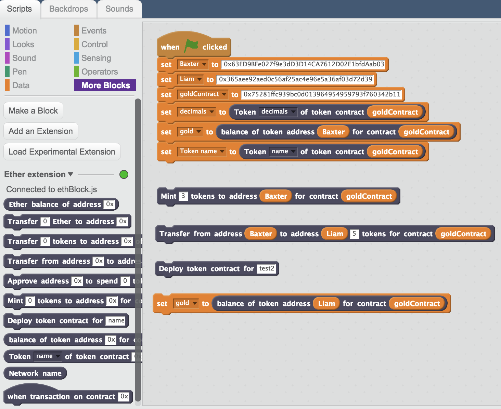
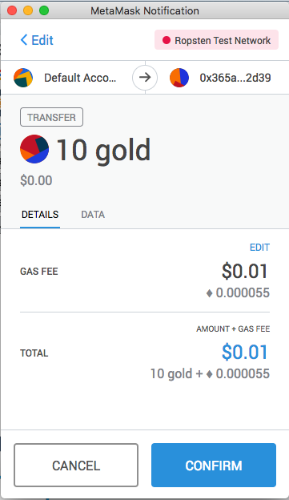

# ScratchX Ethereum Extension Block

A ScratchX extension for connecting to the Ethereum blockchain and ERC20 token contracts.

## Loading the extension

The JavaScript code for the Ethereum extension is in [ethBlock.js](./ethBlock.js). This can be loaded into SctatchX in two was
1. From a local file

Clone this repository to your local machine using
```
git clone https://github.com/naddison36/eth-scratch.git
cd eth-scratch
```

Open the [ScratchX Editor](https://scratchx.org/#scratch) (you will have to allow the Flash plug-in), select the `Scripts` tab and then select `More Blocks`. Then hold the `control` button on the keyboard and click the `Load Experimental Extension` button.

2. From the web

In theory, you can load from an external [url](http://scratchx.org/?https://naddison36.github.io/eth-scratch/ethBlock.js) but I haven't gotten that to work.

## Usage

Once loaded the extension has a number of report and command blocks to get data from the Ethereum blockchain or send signed transaction via a browser wallet like [MetaMask](https://metamask.io/).



Before any of the ERC20 methods can be called the `Set token address` command block must be used. This will instantiate an ERC20 contract that that can then be used in the `transfer`, `transferFrom`, `approve` and `mint` command blocks. It's also needed for the `token balance` report block.

The command blocks should pop up a browser wallet to sign the transaction and send them onto the Ethereum network. Here's and example for signing a token transfer using MetaMask.


## Useful links
* [ScratchX Documentation](https://github.com/LLK/scratchx/wiki#introduction)
* [ScratchX Editor](http://scratchx.org/#scratch)
* [GitHub Pages](https://naddison36.github.io/eth-scratch) site for these extensions 

## Cross-Site Scripting
In order to get around the browser's [cross-site scripting](https://www.owasp.org/index.php/Cross-site_Scripting_(XSS)) rules, ScratchX blocks can be loaded from GitHub Pages with a [crossdomain.xml](./crossdomain.xml) file in the GitHub user's repository, not this project repository. eg [naddison36/naddison36.github.io](https://naddison36/naddison36.github.io/crossdomain.xml). See [Setting up crossdomain.xml](https://github.com/LLK/scratchx/wiki#setting-up-crossdomainxml) for more details.

## Token Contracts

A simple ERC20 contract to test the integration between the Scratch extension and a token contract is [/contracts/GameToken.sol](./contracts/GameToken.sol).

This contract is dependent on the [Open Zeppelin](https://openzeppelin.org/) smart contract library. Run the following to install the Open Zeppelin
```
npm install openzeppelin-solidity
```

The easiest way to compile and deploy the test token contract to a test network like Ropsten is using [Remix](https://remix.ethereum.org/). In order to be able to load all the dependent Open Zeppelin contracts in remix, [remixd](https://github.com/ethereum/remixd#remixd) can be used to connect remix running in the browser to the local filesystem where the GameToken and dependent Open Zeppelin files are found. To install and run remixd

```
npm install -g remixd

remixd -s <your full path>/eth-scratch  --remix-ide https://remix.ethereum.org
```

See [Access your local filesystem by using RemixD](https://remix.readthedocs.io/en/latest/tutorial_remixd_filesystem.html#access-your-local-filesystem-by-using-remixd) for more details.

In order to connect Remix to [MetaMask](https://metamask.io/), the `Enable Personal Mode` setting in Remix needs to be disabled.

Your Ropsten account will need some Ether in order to deploy the contract and send transactions. The [MetaMask Ether Faucet](https://faucet.metamask.io) can be used to get Ropsten Ether.
